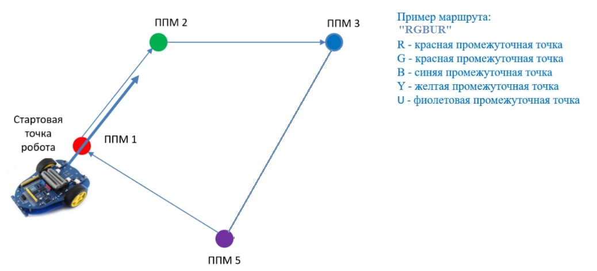
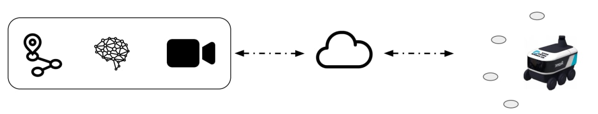
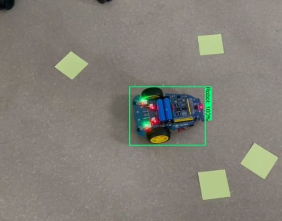

# Using webcam control system of a KasperskyOS robot
## Moscow Aviation Institute featuring Kaspersky Laboratory hackaton.  
As part of the Kaspersky 2022/07 summer hackathon, a prototype of a solution for remote control of an IoT device on KasperskyOS via TCP connection was created  
  
Tasks:  
1. Implement remote connection work with the control program over TCP protocol in one local environment  
2. Implement the functionality with engine control via GPIO ports  
3. Implement the functionality of recognizing the robot and its targets  
4. Create an algorithm for controlling the robot through an external camera  
  
  
## Use case:  

Alphabot should follow predefined path (path consists of several line segments) and stop after that.
  
## Implementation & advantages:
System architecture:  

  
Neural network is used to recognise bot:  

  
Features of bot contol application on KasperksyOS:
1. Implemented functionality related to GPIO, TCP
2. Implemented PWM signal for working with motors
3. Implemented the functionality of accepting commands in JSON format

## Quick Access
[Server folder](source_files/linux_server) - image recognition and bot control server implementation  
[Client folder](source_files/KasperskyOS_client) - KasperskyOS based Alphabot control program implementation  
  
  
## Repository structure
    .  
    ├── source_files/                       # general folder for the project  
    |    ├── linux_server/                  # server folder  
    |    |    ├── main.py                   # main python script  
    |    |    ├── sockets_module.py         # module, what implements TCP part  
    |    |    ├── recognition_module.py     # module, what implements OpenCV part  
    |    |    ├── mask_structure.py         # class describing data structure for marks  
    |    |    ├── calibration_script.py     # script for calibrating masks  
    |    |    └── README.md                 # to-do list  
    |    |  
    |    ├── server_GUI/                    # server gui implementation  
    |    |  
    |    └── KasperskyOS_client/            # client folder  
    |  
    ├── .gitignore  
    ├── LICENSE  
    └── README.md                           # you are here
  
## Credentials
© Tsaturyan Konstantin, Moscow Aviation Institute & Kaspersky Lab  
Moscow, 2022
